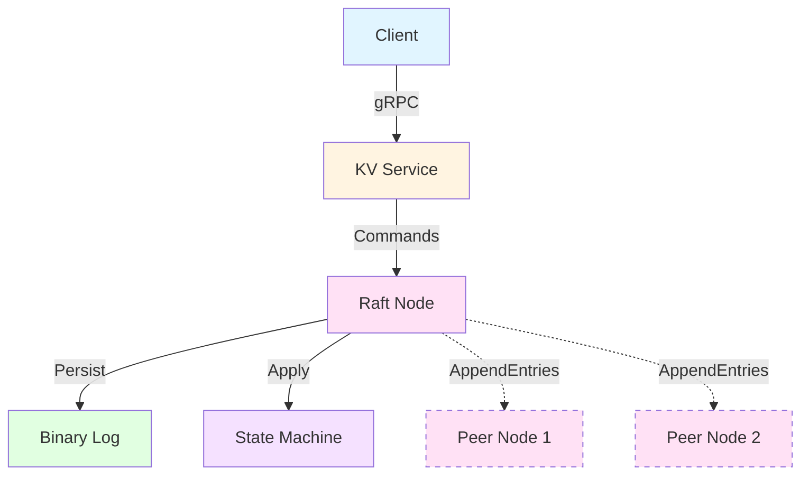

# Lattice

Distributed key-value store implementing Raft consensus from scratch in Rust. I built this to actually understand how systems like etcd work under the hood, not just know that "Raft does consensus" in an abstract way.

## What This Is

It's a working implementation of the Raft algorithm with persistent storage and a gRPC-based KV API. You can run a cluster, write values, kill nodes, bring them back up, and watch the system stay consistent. The kind of stuff that sounds simple until you try to build it.

The codebase handles leader election, log replication, persistent storage, crash recovery, and all the weird edge cases that make distributed systems actually hard. No shortcuts using existing Raft libraries-I wanted to feel the pain of getting the details right.

## Running It

```bash
# Start a 3-node cluster
cargo run --example cluster

# Run all tests (29 unit + integration tests)
cargo test
```

The example boots three nodes, they elect a leader, and a client runs some operations. You'll see the consensus actually happening in the logs.

## Architecture



The system has three layers: a gRPC KV service that clients talk to, the Raft consensus layer that keeps everything consistent, and a persistent binary log for durability. Commands flow down through consensus before being applied to the state machine.

<details>
<summary>Mermaid source (click to expand)</summary>


</details>

## Interesting Problems

### Deadlocks in Async Code

Tokio's RwLock is async, but it won't save you from deadlocking yourself. I had a bug where I held a write lock and then tried to get a read lock on the same resource a few lines later. In sync code this panics immediately. In async code, it hangs forever.

Fixed it by being very explicit about when locks get dropped. If you see a `drop(lock)` in the code, it's probably preventing a deadlock.

### Off-by-One Errors on Steroids

Raft uses 1-based log indices where 0 means "no entry." Rust obviously uses 0-based arrays. Mixing these up doesn't cause a crash-it silently corrupts your distributed state across multiple machines, and you won't notice until way later.

Solution was to make all log access go through functions that handle the conversion, so you literally cannot get the indexing wrong by accident.

### Atomic Log Truncation

When a follower's log diverges from the leader's, you need to truncate it back to the common prefix. Easy enough in memory, but you also need to persist this truncation to disk. And if you crash in the middle, you need to recover to a consistent state.

I went with the simple approach: read everything, truncate the file, write back the entries you're keeping. Not the fastest, but it's obviously correct, and correct beats fast when you're learning.

### Commit Index Math

The leader commits an entry when it's been replicated to a majority AND the entry is from the current term. Miss either condition and you violate safety. I track a match_index for each peer, count how many have replicated past each index, find the highest index with majority replication, and verify it's from the current term.

This is one of those things that's three lines in the paper and like 20 lines of actual code when you account for all the edge cases.

## Code Organization

```
src/
├── kv/
│   ├── mod.rs       # state machine
│   ├── service.rs   # gRPC service
│   └── batch.rs     # operation batching
├── raft/
│   ├── node.rs      # main Raft logic (elections, replication)
│   ├── log.rs       # log abstraction with correct indexing
│   ├── binary_log.rs # persistent storage
│   ├── snapshot.rs  # log compaction
│   ├── config.rs    # dynamic membership
│   ├── peer.rs      # peer communication
│   └── state.rs     # node state
examples/cluster.rs  # 3-node demo
tests/               # integration tests
```

## Testing

All the major components have unit tests. Integration tests spin up actual multi-node clusters and verify operations work end-to-end. The tests found real bugs (deadlocks, wrong state transitions, indexing errors).

Running `cargo test` isn't performative-those tests actually caught issues during development.

## Tech Stack

- Rust 2024 edition (type safety catches a lot of bugs at compile time)
- Tokio for async runtime (no GC pauses during consensus)
- Tonic/gRPC for RPC (type-safe, versioned APIs)
- MessagePack for serialization (compact, fast)

## Features

### Core Raft
- Leader election with randomized timeouts
- Log replication with consistency guarantees
- Persistent binary log with crash recovery
- Commit index advancement with majority tracking

### Advanced Features
- **Snapshotting**: Automatic log compaction when log exceeds 1000 entries
- **InstallSnapshot RPC**: Catch up followers that are too far behind
- **Dynamic Membership**: Add/remove nodes from running cluster via AddServer/RemoveServer RPCs
- **Operation Batching**: Group multiple operations into single Raft entry for improved throughput
- **Lease-Based Reads**: Leader serves read-only queries without log replication when holding valid lease (renewed on heartbeat to majority)
- **Leadership Transfer**: Graceful handoff of leadership via TransferLeadership RPC (leader brings target up to date, sends TimeoutNow to trigger immediate election)

### Not Implemented
- Pre-vote (prevent disruption from partitioned candidates)

## What I Learned

Testing distributed systems is fundamentally different than testing normal code. You need to test timing, crashes, partial failures. Unit tests aren't enough-you need integration tests that actually spawn multiple processes and make them talk to each other.

Lock-free programming is a meme. Locks are fine. Just don't hold them while doing async operations, and release them as soon as possible. The borrow checker will tell you when you're doing something stupid.

The Raft paper is really well written, but there's a ton of details it doesn't cover. What do you do when AppendEntries fails? How do you handle a node that's way behind? When exactly do you reset election timers? You figure this out by implementing it and finding all the ways it breaks.

## License

MIT. Do whatever you want with it.
